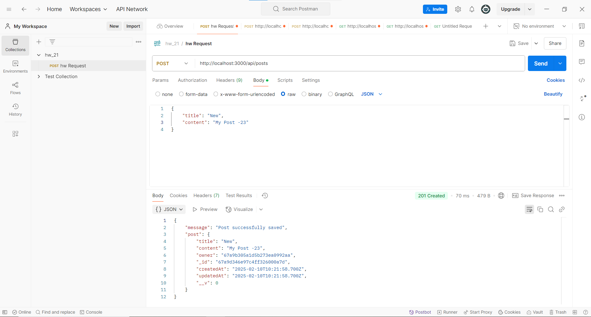

1) **GET** `/api/posts` – отримання всіх дописів поточного користувача, який увійшов до системи. Приклад з Postman!

2) **GET** `/api/posts/:id` – отримання конкретного посту за ID. Навіть якщо користувач не увійшов до системи. Приклад з Postman!

3) **POST** `/api/posts` – створення нового посту.

4) **PUT** `/api/posts/:id` – оновлення посту (дозволяється лише для власника).

5) **DELETE** `**/api/posts/:id**` – видалення посту (дозволяється лише для власника).

**DELETE** дозволяється лише для власника ПРИКЛАД 
